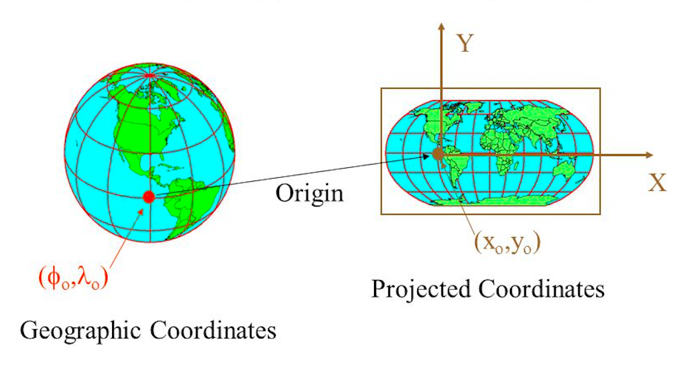
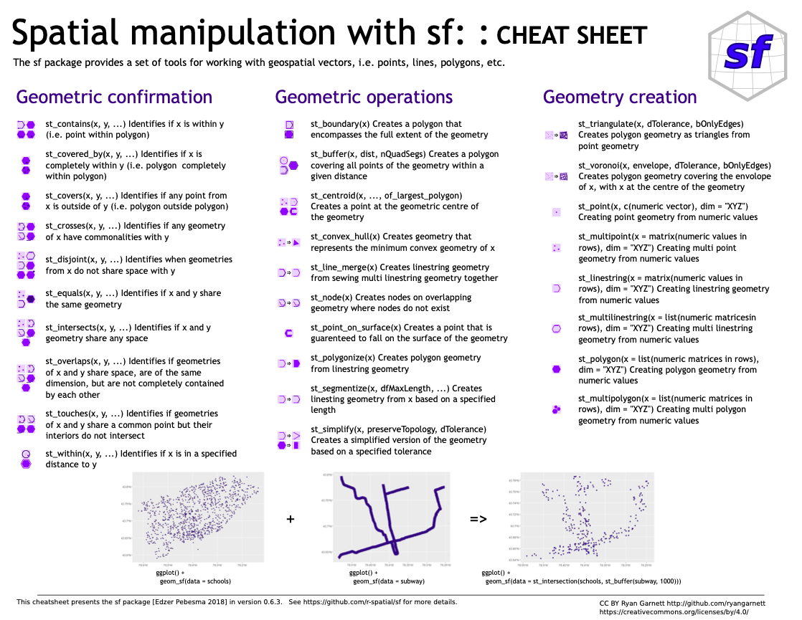

```{r setup, include=FALSE}
# load packages
library(pacman)
pacman::p_load(here,knitr,tidyverse,sf,raster,maps,ggsn,viridis,leaflet)

# option html
options(htmltools.preserve.raw = FALSE)
options(htmltools.dir.version = F)
opts_chunk$set(fig.align="center", fig.height=4 , dpi=300 , cache=F)
```

name: contenido1
# Hoy veremos (parte 1)

1. [Introducción a datos espaciales](#gis)
    
    1.1. Introducción a GIS
    
    1.2. Tipos de datos espaciales
    
    1.3. Formatos de datos GIS
    
    1.4. Sistemas de Coordenadas de Referencia (CRS)

2. [Librería sf](#sf)

    2.1. Introducción a `sf`
    
    2.2. Importar datos espaciales
    
    2.3. Geometría de un dato espacial
    
    2.3. Atributos de un dato espacial

3. [Aplicación en R](#apply1)

<!---------------------------------------->
<!--- Introducción a datos espacialesl --->
<!---------------------------------------->
---
class: inverse, center, middle
name: gis
# [1. Introducción a datos espaciales](#contenido1)

<html><div style='float:left'></div><hr color='#FF007F' size=1px width=796px></html>

---
#1.1. Introducción a GIS
 
**Un Sistema de información geográfico (GIS por sus siglas en inglés)**: "Es un sistema de gestión que permite administrar la data capturada del entorno físico, haciendo uso de sus componentes (hardware, software, información...) para almacenar datos espaciales en forma de capas y realizar análisis multicriterios, permitiendo visualizar la información geográfica mediante el despliegue de mapas digitales o impresos."

<div align="center">

</div>
Tomado de: [https://geopaisa.blog](https://geopaisa.blog)   

---
#1.2. Tipos de datos espaciales
  
**1.2.1. Vectoriales:** 

Son representados mediante una geometría. La geometría se compone de una o más vértices interconectados. Un vértice describe una posición en el espacio utilizando un X, Y (opcionalmente un eje z). Mas información [aquí](https://docs.qgis.org/2.14/es/docs/gentle_gis_introduction/vector_data.html).

- **Puntos:** la geometría consiste en un solo vértice.

- **Líneas o arcos:** la geometría consiste en dos o más vértices y el primer y último vértice no son iguales.

- **Polígonos:** la geometría consiste de tres o más vértices, y el último vértice es igual a la primero.

**1.2.2. Raster:** 

"Un conjunto de datos ráster esta compuesto de filas (corriendo de un lado a otro) y columnas (corriendo hacia abajo) de píxeles (también conocidos como celdas). Cada píxel representa una región geográfica, y el valor en ese píxel representa alguna característica de dicha región". Mas información [aquí](https://docs.qgis.org/2.14/es/docs/gentle_gis_introduction/raster_data.html).

---
#1.2.1. Datos vectoriales

<div align="center">

</div>
Tomado de: [Applied Spatial Data Analysis with R](https://www.springer.com/gp/book/9781461476177)   

---
#1.3. Formatos de datos GIS

**1.3.1. Vectoriales:** 

- shapefile

- .gpkg

- .mtd

- .KML

- Otros...

**1.3.2. Raster:** 

- .tiff

- .nc  

- .nc4

- Otros...

---
#1.3.1. Extenciones de un archivo shapefile

Los shapefiles son unos de los formatos más comunes para almacenar datos espaciales. Este formato define la geometría y los atributos de una entidad a la que se hace referencia geográfica. Esta información se almacena en tres o más archivos con extensiones de archivo concretas que se deben almacenar en el mismo espacio de trabajo:

- .shp: almacena la geometria del objeto la entidad. (**Obligatorio**).

- .shx: almacena el indice de la geometría de la entidad. (**Obligatorio**).

- .dbf: almacena el dataframe con los atributos de la entidad. (**Obligatorio**).

- .prj: almacena información del CRS. (**Opcional**).

Los archivos **.aih**, **.ain**, **.sbn** y **.sbx**, también son opcionales. Puede obtener más información [aquí](http://desktop.arcgis.com/es/arcmap/10.3/manage-data/shapefiles/shapefile-file-extensions.htm).

---
#1.4. Sistemas de Coordenadas de Referencia (CRS)

Todo objeto espacial esta asociado a un CRS (Coordinate Reference Systems). El CRS proporciona una estandarizada referencia espacial de un objeto. En otras palabras, un CRS es una proyección sobre la cual se busca representar de la mejor manera un espacio geográfico. Un CRS puedes ser **Sistema de Coordenadas Geográficas** o un **Sistema de Coordenadas Proyectadas**.

<div align="center">

</div>
Tomado de: [https://slideplayer.com](https://slideplayer.com)  

---
#1.4.1. Sistema de Coordenadas Geográficas - SCG (...)

Es un sistema de referencia que permite identificar ubicaciones sobre la superficie de la curvatura de la tierra. Las ubicaciones se miden en unidades angulares desde el centro de la tierra en relación con dos planos (uno definido en el ecuador y otro definido en el primer meridiano). En este sentido una ubicación se define como la combinación entre un valor de latitud (-90:90) y un valor de longitud (-180:180).

<div align="center">

</div>
Tomado de: [https://mgimond.github.io](https://mgimond.github.io/Spatial/chp09-0.html)  

---
#1.4.1. Sistema de Coordenadas Geográficas - SCG (...)

Un SCG está definido por minimo 3 elementos: Elipsoide, Geoide y el Datum. Estos 3 elementos ayudan a que un SCG represente de una mejor manera la superficie de la Tierra y salve las irregularidades de la misma, ya que esta no es esferica.

<div align="center">

</div>
Tomado de: [https://mgimond.github.io](https://mgimond.github.io/Spatial/chp09-0.html)  

---
#1.4.2. Sistema de Coordenadas Proyectadas - SCP

Es un sistema de referencia de coordenadas bidimensional, se define normalmente mediante dos ejes. Ubicados en angulo recto uno respecto al otro, formando el denominado plano XY (como en un plano cartersiano). Un SCP puede ser Plana,  Cónica o Cilindrica. 

<div align="center">

</div>
Tomado de: [https://docs.qgis.org/](https://docs.qgis.org)  

---
#1.4.3. Ejemplo de un CRS (WGS84)

```{r,eval=T,echo=T,warning=F}
world = st_as_sf(map("world", plot = FALSE, fill = TRUE))
world_map = ggplot(world) + geom_sf(fill = "grey80", col = "grey40", lwd = 0.3)
world_map
```
 
---
#1.4.3. Ejemplo de un CRS (Azimuthal centrada en Bogotá)
```{r,eval=T,echo=T,warning=F}
world_map + coord_sf(crs = "+proj=laea +lon_0=-74 +lat_0=4")
```


<!------------------->
<!--- Librería sf --->
<!------------------->
---
class: inverse, center, middle
name: sf
# [2. Librería sf](#contenido1)

<html><div style='float:left'></div><hr color='#FF007F' size=1px width=796px></html>

Esta librería fue escrita por [Edzer Pebesma](https://github.com/edzer) y [Roger Bivand](https://github.com/rsbivand). Quienes también escribieron el libro **Applied Spatial Data Analysis with R** escrito sobre el paquete sp (la versión anterior de sf).

---
#2.1. Introducción a `sf`

<div align="center">

</div>

---
#2.1.1. Estructura de un objeto espacial 

<div align="center">

</div>
Tomado de: [https://docs.qgis.org](https://docs.qgis.org)   

---
#2.2. Importar datos espaciales (...)
```{r,eval=T,echo=T,warning=T}
# cargar shapefile  (opción 1)
puntos = st_read(dsn="data/input" , layer="points_barranquilla")

# cargar shapefile (opción 2)
puntos = st_read("data/input/points_barranquilla.shp")
```

---
#2.2. Importar datos espaciales (...)
Visualicemos lo que hemos importado..

```{r,eval=T,echo=T,warning=T}
ggplot() + geom_sf(data=puntos[1:5,] , col="red") + theme_light()
```

---
#2.2. Importar datos espaciales (...)
Visualicemos lo que hemos importado..

```{r,eval=T,echo=T,warning=T,fig.height=1.5,fig.width=2.5}
leaflet() %>% addTiles() %>% addCircleMarkers(data = puntos[1:5,])
```

---
#2.3. Geometría de un dato espacial (...)
```{r,eval=T,echo=T,warning=T}
# Obtener CRS
puntos %>% st_crs()
```

---
#2.3. Geometría de un dato espacial (...)
```{r,eval=T,echo=T,warning=T}
# Obtener bbox
puntos %>% st_bbox()

# Obtener vértices
puntos %>% st_geometry()
```

---
#2.4. Atributos de un dato espacial (...)
```{r,eval=T,echo=T,warning=T}
# Obtener tipo de objeto
puntos %>% class()

# Ver variables dataframe
puntos %>% colnames()

# Tabla de frecuencias
puntos$MPIO_CCDGO %>% table()
```

---
#2.4. Atributos de un dato espacial (...)
```{r,eval=T,echo=T,warning=T}
# Eliminar variables
puntos = puntos %>% dplyr::select(MPIO_CCDGO)

# Observen que siempre conserva la geometría
puntos %>% colnames()

# Veamos...
puntos %>% head()
```

---
#2.4. Atributos de un dato espacial (...)
```{r,eval=T,echo=T,warning=T}
# generar dato
data = data.frame(MPIO_CCDGO= puntos$MPIO_CCDGO %>% unlist() %>% 
                              unique(),
                  TASA = rnorm(n=23 , mean=1000 , sd=10) %>% round())

# Agregar variables de otra base de datos
puntos = left_join(puntos,data,"MPIO_CCDGO")

# Veamos...
puntos %>% head()
```

<!--------------------->
<!---    Hoy vimos  --->
<!--------------------->
---
class: inverse, center, middle
name: view

# [Hoy vimos...](#contenido1)
<html><div style='float:left'></div><hr color='#FF007F' size=1px width=796px></html>

---
#  Hoy vimos...

- ☑ [Introducción a datos espaciales](#gis)
    
- ☑ [Librería sf](#sf)

<!----------------------->
<!--- Aplicación en R --->
<!----------------------->
---
class: inverse, center, middle
name: apply1
# [Aplicación en R](#contenido1)
<html><div style='float:left'></div><hr color='#FF007F' size=1px width=796px></html>

Vamos a Rstudio a replicar lo que hemos visto...
